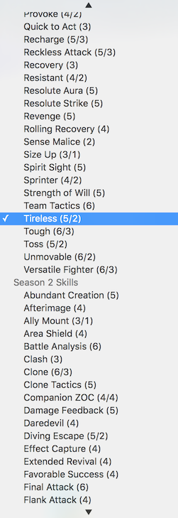

I generally expect people to be well-rounded in some way or another, having multiple areas of their life to proritize and spend differing amounts of time on. For me, these areas include my career, my church life, and a number of neither-of-the-two social activities including some roleplaying.

As far as that last one, my system of choice lately has been [Valor](), which takes more than a few cues from fourth edition Dungeons and Dragons while also kind of being its own thing. For one, you only ever need one die; the 10-sided one. It was developed over the course of several years by two guys who started working on it while they were college roommates and I only met later over the Internet in circumstances I don't entirely remember.

The real core concept of Valor, however, is to be shonen anime as hell, which is one thing it succeeds at. Incidentally, the original context of the "doubling down on a one-off thing that happened" quote that inspired April's blog post was in response to something I had decided on for one of my campaigns around that time and none of the other players completely grasped for a few weeks (at least, as far as I know).

More to the point, it hasn't been around long enough to have that many tools for making character creation, which is pretty math-heavy, much easier. One of the cocreators wrote a roll20 plugin that does this, but it's not exactly portable, and skill selection is, well...

...a little tedious.

Of course, I'm a web developer, so I decided to just make one.

Here's some early thoughts on the design. Some of this is implemented, some I've got ideas, and some is pretty far off still.

A Valor character (or enemy) has three main sets of changeable stuff: attributes, skills, and techniques.

Attributes are the simplest: it's all math, and furthermore all - _mostly_ - derivable solely from their character level, base attributes, and entity type (Elite, Soldier, Flunky, Swarm, or Master). Entity type affects most secondary attributes multiplicatively; the exceptions are the Active Attributes.

Skills are more or less what many editions of D&D called Feats - passive abilities or special combat or out-of-combat actions. Valor Skills are alphabetized within category only in the book. A number of Skills directly modify certain attributes. There are also "Flaws", anti-Skills that provide penalties either passively or situationally. However, they act more or less the same way as Skills, so one of my design decisions is to just treat Flaws as a Skill category.

Techniques loosely correspond to 4E's Powers, but Valor Techniques are not premade and have their own components - a Core (what it does at the most basic level, such as "heal" or "do damage"), Modifiers (secondary effects, changes to targeting, etc.), and Limits (Stamina-saving measures that prevent the Technique from being used in all circumstances, in effect trading flexibility for being able to use it more often).

Here's the progress I've made so far:
 - <input> controls for level and the five base attributes. These are wrapped in a React component I called the AttributeInput, which is functional and stateless.
 - A simple view component for secondary attributes. These are calculated automatically (by CharacterAttributesContainer, for now - most of these are going to need to be moved up to the base CharacterBuilder) based on the above six things, and the character's type, which I added later.
 - A 'constants' directory with some files containing constants for use in calculating the above and a few things that might be necessary across the app.
 - A dropdown select component that - right now - the only use of which is the entity type selection. It will automatically turn the NPC flag on if it's set to Flunky, Swarm, or Master (players' Summon Core techniques are linked to a Soldier, so Soldiers can still be PCs technically.)

My next step is going to be to get skills off the ground, and I don't expect that to be easy.
